<div align="center">

```
   ██████╗  █████╗ ███████╗    ████████╗ ██████╗ ██╗    ██╗███╗   ██╗
  ██╔════╝ ██╔══██╗██╔════╝    ╚══██╔══╝██╔═══██╗██║    ██║████╗  ██║
  ██║  ███╗███████║███████╗       ██║   ██║   ██║██║ █╗ ██║██╔██╗ ██║
  ██║   ██║██╔══██║╚════██║       ██║   ██║   ██║██║███╗██║██║╚██╗██║
  ╚██████╔╝██║  ██║███████║       ██║   ╚██████╔╝╚███╔███╔╝██║ ╚████║
   ╚═════╝ ╚═╝  ╚═╝╚══════╝       ╚═╝    ╚═════╝  ╚══╝╚══╝ ╚═╝  ╚═══╝
```

**Run Claude Code agents as Kubernetes pods.**

[](https://github.com/boshu2/gastown-operator/releases/latest) [](https://github.com/boshu2/gastown-operator/releases/latest) [](https://ghcr.io/boshu2/charts/gastown-operator) [](https://www.redhat.com/en/technologies/cloud-computing/openshift) [](#editions)

*⚡ WITNESS ME! Shiny and Chrome. ⚡*

</div>

---

## What You Get

You run Gas Town locally. This operator runs your polecats as Kubernetes pods.

Your workflow doesn't change. The `gt` CLI you already use works exactly the same.
The operator just gives you more compute - as much as your cluster can handle.

| On Your Laptop | With the Operator |
|----------------|-------------------|
| ~20-30 polecats (CPU bound) | **Hundreds** |
| Laptop stays open | **Close your laptop** |
| You're online | **Town runs 24/7** |
| One machine | **Horizontal scale** |

**The unlock:** Queue 50 issues. Dispatch 50 polecats. Close your laptop. Come back to PRs.

```mermaid
flowchart TB
    subgraph Local["Your Laptop (Optional)"]
        Mayor["🎩 Mayor<br/>Orchestrates"]
        GT[gt CLI]
    end

    subgraph K8s["Kubernetes Cluster"]
        OP[Gas Town Operator]
        Witness["👁️ Witness<br/>Monitors health"]
        Refinery["⚙️ Refinery<br/>Merges PRs"]
        subgraph Polecats["Polecat Pods"]
            P1[🦨 furiosa]
            P2[🦨 nux]
            P3[🦨 capable]
        end
    end

    subgraph Git["Git Remote"]
        Repo[(Your Repo)]
        PRs[Pull Requests]
        Main[main branch]
    end

    Mayor -->|"gt sling"| GT
    GT -->|"kubectl gt sling"| OP
    OP -->|spawns| Polecats
    Witness -->|monitors| Polecats
    Polecats -->|push branches| Repo
    Polecats -->|create| PRs
    Refinery -->|rebase + test| PRs
    Refinery -->|merge| Main

    style Local fill:#1a1a2e,color:#fff
    style K8s fill:#0d47a1,color:#fff
    style Git fill:#238636,color:#fff
```



**Full Gas Town functionality.** Mayor dispatches work, Witness monitors polecat health, Refinery merges PRs after testing. Same workflow you use locally - the operator just gives you more compute.

---

## What Runs in Your Cluster

### The Operator (1 Pod)

The operator is a single deployment that watches for CRs and reconciles them:

```
gastown-system namespace:
└── gastown-operator-controller-manager (1 pod, ~64MB memory)
    └── Watches: Rig, Polecat, Convoy, Witness, Refinery, BeadStore
```

That's it. One small pod runs all the controllers.

### Custom Resources

| CR | Scope | What It Does | Creates Pods? |
|----|-------|--------------|---------------|
| **Rig** | Cluster | Defines a project workspace. Auto-creates Witness + Refinery. | No |
| **Polecat** | Namespace | An AI worker. Creates a pod that runs Claude Code. | **Yes** (1 pod per Polecat) |
| **Witness** | Namespace | Monitors polecat health. Detects stuck workers, escalates. | No |
| **Refinery** | Namespace | Watches for completed polecats (`Available=True`), merges PRs. | No |
| **Convoy** | Namespace | Tracks a batch of polecats for parallel execution. | No |
| **BeadStore** | Namespace | Optional. Configures beads issue tracking backend. | No |

### What Actually Runs

```
Cluster
├── gastown-system namespace
│   ├── gastown-operator-controller-manager  ← Always running (1 pod)
│   ├── Witness CRs                          ← Just data, no pods
│   ├── Refinery CRs                         ← Just data, no pods
│   └── Polecat CRs                          ← Each creates a pod ↓
│       ├── polecat-furiosa (pod)            ← Running Claude Code
│       ├── polecat-nux (pod)                ← Running Claude Code
│       └── polecat-capable (pod)            ← Running Claude Code
└── Rig CRs (cluster-scoped)                 ← Just data, no pods
```

**Key insight:** Only Polecats create pods. Everything else is just Kubernetes custom resources that the operator watches and updates. The Witness and Refinery controllers run inside the operator pod - they don't spawn separate pods.

### Resource Usage

| Component | CPU | Memory | Count |
|-----------|-----|--------|-------|
| Operator | 10m-500m | 64-128MB | 1 |
| Polecat pod | 100m-2000m | 512MB-4GB | 0-N (on demand) |

---

### Prerequisites

This operator extends Gas Town to Kubernetes. You'll need:

1. **Gas Town installed locally** - The `gt` CLI ([github.com/steveyegge/gastown](https://github.com/steveyegge/gastown))
2. **Claude Code configured** - `~/.claude/` directory with your settings
3. **A rig initialized** - At least one project workspace in `~/gt/`
4. **Kubernetes cluster** - Any cluster you can deploy to (local or cloud)

If you want standalone K8s agents without the Gas Town workflow, see [Advanced: Standalone Mode](#advanced-standalone-mode) below.

---

### Terminology

| Term | What It Is |
|------|------------|
| **Polecat** | An AI worker (runs as a pod) that executes coding tasks |
| **Rig** | A project workspace - one repo, many polecats |
| **Convoy** | A batch of tasks for parallel execution |
| **Beads** | Git-based issue tracker ([separate project](https://github.com/steveyegge/beads)) |

---

## Quick Start

### 1. Install the Operator

```bash
helm install gastown-operator oci://ghcr.io/boshu2/charts/gastown-operator \
  --version 0.4.2 \
  --namespace gastown-system \
  --create-namespace
```

### 2. Install the kubectl Plugin

```bash
# Download for your platform (auto-detects OS and architecture)
ARCH=$(uname -m | sed 's/x86_64/amd64/' | sed 's/aarch64/arm64/')
curl -LO "https://github.com/boshu2/gastown-operator/releases/download/v0.4.2/kubectl-gt-$(uname -s | tr '[:upper:]' '[:lower:]')-${ARCH}"
chmod +x kubectl-gt-* && sudo mv kubectl-gt-* /usr/local/bin/kubectl-gt
```

### 3. Create a Rig and Dispatch Work

```bash
# Create a project rig
kubectl gt rig create my-project \
  --git-url https://github.com/org/repo.git \
  --prefix mp \
  -n gastown-system

# Sync your Claude configuration to the cluster
# This uploads your entire ~/.claude/ directory as a K8s Secret
# so polecat pods can run Claude with your skills, hooks, and settings
kubectl gt auth sync -n gastown-system

# Dispatch a polecat to work on an issue
kubectl gt sling issue-123 my-project --name furiosa -n gastown-system

# Watch it work
kubectl gt polecat logs my-project/furiosa -f -n gastown-system
```

**For AI Agents:** See [AGENT_INSTRUCTIONS.md](AGENT_INSTRUCTIONS.md) for setup instructions.

---

## kubectl-gt CLI (New in v0.4.1)

**The recommended way to interact with Gas Town.** AI-native interface designed for both humans and agents.

### Core Commands

| Command | Description |
|---------|-------------|
| `kubectl gt rig list` | List all rigs |
| `kubectl gt rig status <name>` | Show rig details |
| `kubectl gt rig create <name>` | Create a new rig |
| `kubectl gt polecat list [rig]` | List polecats |
| `kubectl gt polecat status <rig>/<name>` | Show polecat details |
| `kubectl gt polecat logs <rig>/<name>` | Stream polecat logs |
| `kubectl gt polecat nuke <rig>/<name>` | Terminate a polecat |
| `kubectl gt sling <bead-id> <rig>` | Dispatch work to a polecat |
| `kubectl gt convoy list` | List convoy batches |
| `kubectl gt convoy create <desc> <beads...>` | Create convoy |
| `kubectl gt auth sync` | Sync ~/.claude/ to cluster (skills, hooks, settings) |
| `kubectl gt auth status` | Check credential status |

### AI-Native Features

**JSON/YAML Output** - All commands support `-o json` and `-o yaml` for machine parsing:

```bash
# Parse polecat list in scripts
kubectl gt polecat list -o json | jq '.[] | .metadata.name'

# Get rig status as YAML
kubectl gt rig status my-rig -o yaml
```

**Themed Naming** - Memorable names for your polecats:

```bash
# Named polecat
kubectl gt sling at-1234 athena --name furiosa

# Random themed name (mad-max, minerals, wasteland)
kubectl gt sling at-1234 athena --theme mad-max
# → Creates polecat named "capable" or "toast" etc.
```

**Wait for Ready** - Block until polecat pod is running:

```bash
# Wait for pod to be scheduled and ready
kubectl gt sling at-1234 athena --wait-ready --timeout 5m
```

**Native Log Streaming** - Stream logs directly without kubectl delegation:

```bash
# Follow logs
kubectl gt polecat logs athena/furiosa -f

# Specific container
kubectl gt polecat logs athena/furiosa -c claude -f
```

### Installation

See [Quick Start](#2-install-the-kubectl-plugin) for the one-liner, or build from source:

```bash
make kubectl-gt-install
```

---

## YAML Templates (Alternative)

If you prefer declarative YAML over the CLI:

```yaml
apiVersion: gastown.gastown.io/v1alpha1
kind: Polecat
metadata:
  name: my-task
spec:
  rig: my-project
  desiredState: Working
  kubernetes:
    gitRepository: "git@github.com:org/repo.git"
    gitSecretRef:
      name: git-ssh-key
    claudeCredsSecretRef:
      name: claude-creds
  task:
    description: "Implement feature X"
```

See [templates/](templates/) for all resource examples.

## Features

| Feature | What It Means |
|---------|---------------|
| **Scale to 100+ agents** | Run 10, 50, or 100 polecats in parallel. No tmux limits. |
| **One-command install** | `helm install` and you're running in 30 seconds |
| **Instant agent startup** | Pre-built images with Claude Code. No npm install at runtime. |
| **Enterprise-ready** | OpenShift native, FIPS-compliant edition, security-scanned |
| **Agent-first docs** | Tell Claude to set it up. It reads the docs and configures itself. |
| **Full lifecycle management** | Health monitoring, auto-cleanup, merge queue, convoy tracking |
| **Multi-arch** | Runs on amd64 and arm64. Your infra, your choice. |
| **Supply chain security** | SBOM, Trivy scans, provenance attestations on every image |

**Why Kubernetes over local?**
- **Horizontal scale**: Your laptop runs 20-30 agents. A cluster runs hundreds.
- **Zero infrastructure**: No tmux, no screen, no SSH. Just pods.
- **Built-in resilience**: Kubernetes restarts failed agents automatically.
- **Resource isolation**: Each polecat gets dedicated CPU/memory.

## How It Works

The operator is **CRD-driven**. You create a Polecat custom resource, and the operator handles the rest.

### Happy Path (Kubernetes Mode)

```
You                          Kubernetes                      Git
 │                              │                              │
 ├─ kubectl apply polecat.yaml ─►                              │
 │   (executionMode: kubernetes) │                              │
 │                              │                              │
 │                    Operator creates Pod                     │
 │                              │                              │
 │                    ┌─────────▼─────────┐                    │
 │                    │   Polecat Pod     │                    │
 │                    │  ┌─────────────┐  │                    │
 │                    │  │ Claude Code │  │                    │
 │                    │  │  - clones   │──┼── git clone ───────►
 │                    │  │  - works    │  │                    │
 │                    │  │  - commits  │──┼── git push ────────►
 │                    │  └─────────────┘  │                    │
 │                    └───────────────────┘                    │
 │                              │                              │
 ◄── kubectl get polecat ───────┤                              │
     (status: Done)             │                              │
```

**Step by step:**

1. **Create secrets** for git SSH key and Claude credentials
2. **Apply a Polecat CR** with your task:
   ```yaml
   apiVersion: gastown.gastown.io/v1alpha1
   kind: Polecat
   metadata:
     name: my-task
   spec:
     rig: my-project
     executionMode: kubernetes
     desiredState: Working
     kubernetes:
       gitRepository: "git@github.com:org/repo.git"
       gitSecretRef:
         name: git-ssh-key
       claudeCredsSecretRef:
         name: claude-creds
     task:
       description: "Implement feature X"
   ```
3. **Operator creates a Pod** with Claude Code pre-installed
4. **Pod runs Claude**, which clones, implements, commits, and pushes
5. **Results appear in git** - the branch is pushed, PR created if configured
6. **Check status**: `kubectl get polecat my-task`

### What Goes Where

| Data | Location | How to Access |
|------|----------|---------------|
| Work progress | Pod logs | `kubectl logs polecat-my-task` |
| Final code | Git remote | Pushed to branch |
| Polecat status | CRD status | `kubectl get polecat -o yaml` |

## Installation Options

### Option 1: Helm (Recommended)

```bash
# Standard Kubernetes
helm install gastown-operator oci://ghcr.io/boshu2/charts/gastown-operator \
  --version 0.4.2 \
  --namespace gastown-system \
  --create-namespace
```

### Option 2: Helm for OpenShift

OpenShift requires stricter security settings:

```bash
helm install gastown-operator oci://ghcr.io/boshu2/charts/gastown-operator \
  --version 0.4.2 \
  --namespace gastown-system \
  --create-namespace \
  --set securityContext.allowPrivilegeEscalation=false \
  --set securityContext.runAsNonRoot=true \
  --set securityContext.runAsUser=null \
  --set securityContext.readOnlyRootFilesystem=true \
  --set volumes.enabled=false
```

Or use the FIPS-compliant image for regulated environments:

```bash
helm install gastown-operator oci://ghcr.io/boshu2/charts/gastown-operator \
  --version 0.4.2 \
  --namespace gastown-system \
  --create-namespace \
  --set image.tag=0.4.2-fips \
  --set securityContext.allowPrivilegeEscalation=false \
  --set securityContext.runAsNonRoot=true \
  --set securityContext.runAsUser=null \
  --set securityContext.readOnlyRootFilesystem=true \
  --set volumes.enabled=false
```

### Option 3: From Source

```bash
make install      # Install CRDs
make deploy IMG=ghcr.io/boshu2/gastown-operator:0.4.2
```

## Custom Resources

See [What Runs in Your Cluster](#what-runs-in-your-cluster) for details on each CR and what actually runs as pods.

## Templates

Copy-paste YAML templates for all resources:

| Template | Purpose |
|----------|---------|
| [polecat-minimal.yaml](templates/polecat-minimal.yaml) | Simple polecat example |
| [polecat-kubernetes.yaml](templates/polecat-kubernetes.yaml) | Full polecat with all options |
| [convoy.yaml](templates/convoy.yaml) | Batch tracking |
| [witness.yaml](templates/witness.yaml) | Health monitoring |
| [refinery.yaml](templates/refinery.yaml) | Merge processing |
| [secret-git-ssh.yaml](templates/secret-git-ssh.yaml) | Git SSH credentials |
| [secret-claude-creds.yaml](templates/secret-claude-creds.yaml) | Claude API credentials |

Validate before applying:

```bash
./scripts/validate-template.sh templates/polecat-kubernetes.yaml
```

See [FRICTION_POINTS.md](FRICTION_POINTS.md) for common mistakes and fixes.

## Configuration

### Helm Values

| Parameter | Default | Description |
|-----------|---------|-------------|
| `image.repository` | `ghcr.io/boshu2/gastown-operator` | Container image |
| `image.tag` | `0.4.2` | Image tag |
| `replicaCount` | `1` | Number of replicas |

See [values.yaml](helm/gastown-operator/values.yaml) for full configuration.

## Architecture

```
┌────────────────────────────────────────────────────────┐
│                  Kubernetes Cluster                     │
│                                                         │
│   ┌─────────────────────────────────────────────────┐  │
│   │              gastown-operator                    │  │
│   │                                                  │  │
│   │   Rig       Polecat     Convoy     Witness      │  │
│   │ Controller  Controller  Controller  Controller  │  │
│   └──────────────────┬──────────────────────────────┘  │
│                      │                                  │
│          ┌───────────┴───────────┐                     │
│          ▼                       ▼                     │
│   ┌─────────────┐         ┌─────────────┐             │
│   │   Polecat   │   ...   │   Polecat   │             │
│   │    (Pod)    │         │    (Pod)    │             │
│   │  ┌───────┐  │         │  ┌───────┐  │             │
│   │  │Claude │  │         │  │Claude │  │  ───► Git   │
│   │  │ Code  │  │         │  │ Code  │  │             │
│   │  └───────┘  │         │  └───────┘  │             │
│   └─────────────┘         └─────────────┘             │
└────────────────────────────────────────────────────────┘
```

The operator manages the full polecat lifecycle. Kubernetes handles scheduling, scaling, and restarts.

## Container Images

All images are published to GHCR with SBOM, Trivy scans, and provenance attestations.

| Image | Purpose | Tags |
|-------|---------|------|
| `ghcr.io/boshu2/gastown-operator` | Kubernetes operator | `0.4.2`, `latest`, `0.4.2-fips` |
| `ghcr.io/boshu2/polecat-agent` | Pre-built polecat agent | `0.4.2`, `latest` |
| `ghcr.io/boshu2/charts/gastown-operator` | Helm chart (OCI) | `0.4.2` |

### Polecat Agent Image

The `polecat-agent` image comes with Claude Code pre-installed:

```bash
docker pull ghcr.io/boshu2/polecat-agent:0.4.2
```

**Benefits:**
- Instant startup (no runtime npm install)
- Pinned, documented component versions
- Security-scanned (Trivy) with SBOM
- No external network dependencies at runtime

**Included components:**
| Component | Version |
|-----------|---------|
| Claude Code | 2.0.22 (native binary) |
| gt CLI | latest |
| git, ssh, jq | system |

See [images/polecat-agent/](images/polecat-agent/) for build details and [CUSTOMIZING.md](images/polecat-agent/CUSTOMIZING.md) to extend the image with your own tools.

## Requirements

- Kubernetes 1.26+ or OpenShift 4.13+
- Helm 3.8+
- Git SSH credentials (for polecat git operations)
- LLM API credentials (Anthropic, OpenAI, or Ollama)

## Editions

| | **Community** | **Enterprise (FIPS)** |
|---|---|---|
| **Target** | Vanilla Kubernetes | OpenShift / Regulated |
| **Base Image** | `distroless` | Red Hat UBI9 |
| **Crypto** | Standard Go | FIPS-validated (BoringCrypto) |
| **Image Tag** | `0.4.2` | `0.4.2-fips` |

## Related Projects

- [Gas Town](https://github.com/steveyegge/gastown) - The multi-agent orchestration framework
- [Claude Code](https://github.com/anthropics/claude-code) - AI coding agent from Anthropic
- [Beads](https://github.com/steveyegge/beads) - Git-based issue tracking

## Advanced: Standalone Mode

**Not using Gas Town?** You can run the operator standalone - just Kubernetes and Claude credentials. This is useful for CI/CD pipelines or teams that want K8s agents without the Gas Town workflow.

### What You Lose

Standalone mode skips the Gas Town orchestration layer:

| Feature | With Gas Town | Standalone |
|---------|---------------|------------|
| Beads issue tracking | Yes | No |
| Inter-agent mail | Yes | No |
| Convoy batching | Yes | Manual only |
| Skills/hooks from ~/.claude/ | Synced automatically | Mount manually |
| `gt sling` dispatch | Yes | kubectl apply |

### Standalone YAML Example

```yaml
apiVersion: gastown.gastown.io/v1alpha1
kind: Polecat
metadata:
  name: standalone-task
  namespace: gastown-system
spec:
  rig: standalone
  executionMode: kubernetes
  desiredState: Working
  kubernetes:
    gitRepository: "git@github.com:your-org/your-repo.git"
    gitSecretRef:
      name: git-ssh-key
    claudeCredsSecretRef:
      name: claude-creds
  task:
    description: |
      Implement feature X. Requirements:
      - Add new endpoint /api/v1/feature
      - Include tests
      - Update API documentation
```

Create the secrets first:

```bash
# Claude API key
kubectl create secret generic claude-creds \
  --from-literal=ANTHROPIC_API_KEY=sk-ant-xxx \
  -n gastown-system

# Git SSH key
kubectl create secret generic git-ssh-key \
  --from-file=ssh-privatekey=$HOME/.ssh/id_ed25519 \
  -n gastown-system
```

Then apply:

```bash
kubectl apply -f polecat.yaml
kubectl logs -f -l gastown.io/polecat=standalone-task -n gastown-system
```

For the full Gas Town experience (beads, mail, skills), install Gas Town first: [github.com/steveyegge/gastown](https://github.com/steveyegge/gastown)

---

## Contributing

PRs welcome. Please:
1. Run `make validate` before pushing
2. Add tests for new controllers
3. Keep the Mad Max references tasteful

See [CONTRIBUTING.md](CONTRIBUTING.md) for details.

## Changelog

See [CHANGELOG.md](CHANGELOG.md) for version history.

## License

Apache 2.0. See [LICENSE](LICENSE).

---

*Built with mass production*
