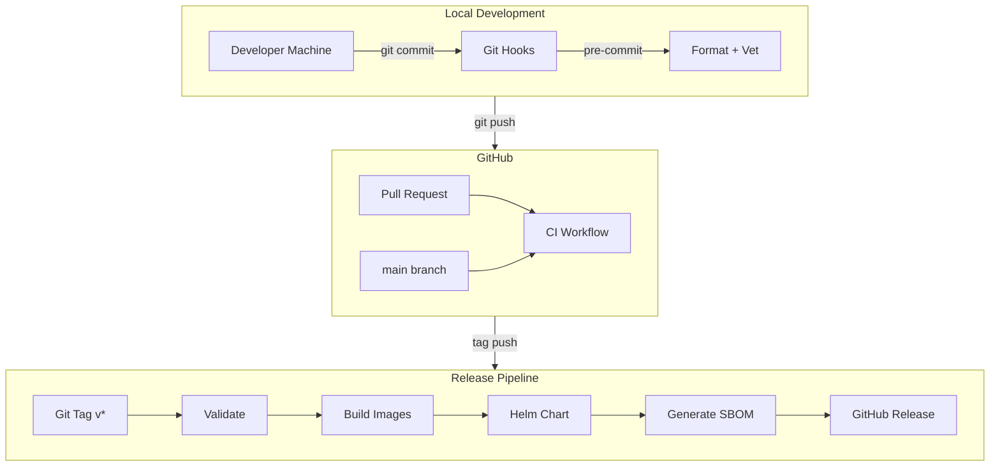

# Gastown Operator - Deployment Guide

This document describes how to deploy the gastown-operator and the CI/CD pipeline that publishes releases.

## CI/CD Pipeline


```mermaid
flowchart TB
    subgraph LOCAL["Local Development"]
        DEV[Developer Machine]
        HOOKS[Git Hooks]
        DEV -->|git commit| HOOKS
        HOOKS -->|pre-commit| PC[Format + Vet]
    end

    subgraph GH["GitHub"]
        PR[Pull Request]
        MAIN[main branch]
        CI[CI Workflow]
        PR --> CI
        MAIN --> CI
    end

    subgraph RELEASE["Release Pipeline"]
        TAG[Git Tag v*]
        VALIDATE[Validate]
        BUILD[Build Images]
        HELM[Helm Chart]
        SBOM[Generate SBOM]
        GHR[GitHub Release]
        TAG --> VALIDATE --> BUILD --> HELM --> SBOM --> GHR
    end

    LOCAL -->|git push| GH
    GH -->|tag push| RELEASE
```

### CI Workflow (Every PR + Push to Main)

| Job | What It Checks |
|-----|----------------|
| validate | go.mod tidy, go vet, generated code, manifests |
| lint | golangci-lint |
| test | Unit tests with envtest |
| prescan | Complexity, code quality |
| security | govulncheck, gosec, gitleaks |
| build | Binaries + container image (no push) |
| e2e | Kind cluster tests (main branch only) |

### Release Pipeline (Tag Push)

| Step | Owner | Output |
|------|-------|--------|
| Pre-flight | release.yml | Version validation |
| Validation | release.yml | go mod tidy, tests, lint |
| Container images | release.yml + Buildx | Multi-arch image on GHCR |
| Image signing | Cosign (keyless) | Signed image attestation |
| Helm chart | release.yml | OCI chart on GHCR |
| kubectl-gt binaries | GoReleaser | Cross-platform binaries |
| SBOM | Syft | SPDX + CycloneDX |
| GitHub Release | release.yml | Binaries, manifests, SBOMs |

## Installation

### Helm (Recommended)

```bash
helm install gastown-operator \
  oci://ghcr.io/boshu2/charts/gastown-operator \
  --version <VERSION> \
  -n gastown-system --create-namespace
```

### kubectl

```bash
kubectl apply -f https://github.com/boshu2/gastown-operator/releases/download/v<VERSION>/install.yaml
```

### Verify

```bash
kubectl get pods -n gastown-system
kubectl get crds | grep gastown
```

## Release Artifacts

| Artifact | Location |
|----------|----------|
| Container image | `ghcr.io/boshu2/gastown-operator:<VERSION>` |
| Helm chart | `oci://ghcr.io/boshu2/charts/gastown-operator:<VERSION>` |
| Install manifest | GitHub Release `install.yaml` |
| kubectl-gt binaries | GitHub Release (darwin/linux, amd64/arm64) |
| SBOM | GitHub Release (SPDX + CycloneDX) |

## Nightly Builds

The nightly workflow runs daily at 4 AM UTC and includes:

- Fresh build (no cache) with latest dependencies
- Multi-Kubernetes version matrix (1.29, 1.30, 1.31)
- Security audit (govulncheck, gosec, Trivy)
- Container image vulnerability scan
- Auto-creates GitHub issue on failure

## Dependency Management

Renovate GitHub App manages dependency updates automatically:

- **Go modules**: PRs for `go.mod` / `go.sum` updates
- **GitHub Actions**: Auto-merged minor/patch updates
- **Dockerfiles**: PRs for base image updates
- **Makefile tool versions**: Custom regex managers

## Failure Scenarios

| Failure | Action |
|---------|--------|
| Pre-commit hooks fail | Fix locally before committing |
| CI validation fails | Fix and push again |
| Release validation fails | Fix on main, re-tag |
| Image build fails | Check Dockerfile and dependencies |
| Helm push fails | Check GHCR permissions |
