# Gastown Operator - CI/CD Deployment Guide

This document describes the complete CI/CD pipeline from local development to production release.

## Architecture Overview

```mermaid
flowchart TB
    subgraph LOCAL["🖥️ Local Development"]
        DEV[Developer Machine]
        HOOKS[Git Hooks]
        DEV -->|git commit| HOOKS
        HOOKS -->|pre-commit| PC[Format + Vet]
        HOOKS -->|pre-push| PP[Lint + Test + Build]
    end

    subgraph GITLAB["🦊 GitLab (Behind VPN)"]
        MR[Merge Request]
        MAIN[main branch]
        VALIDATE[Validate Stage]
        VERSION[semantic-release]

        PP -->|push| MR
        MR -->|merge| MAIN
        MAIN --> VALIDATE
        VALIDATE --> VERSION
    end

    subgraph TEKTON["⚙️ Tekton Pipeline (olympus-ci)"]
        CLONE[Clone]
        SCAN[7 Security Scans]
        BUILD[Build Image]
        SIGN[Sign + SBOM]
        INTERNAL[Push to Internal Registry]

        VERSION -->|trigger| CLONE
        CLONE --> SCAN
        SCAN --> BUILD
        BUILD --> SIGN
        SIGN --> INTERNAL
    end

    subgraph TEST["🧪 E2E Testing"]
        UPGRADE[Helm Upgrade Test<br/>gastown-test-upgrade]
        FRESH[Fresh Install Test<br/>gastown-test-fresh]
        E2E[Smoke Tests]

        INTERNAL --> UPGRADE
        INTERNAL --> FRESH
        UPGRADE --> E2E
        FRESH --> E2E
    end

    subgraph PUBLISH["📦 Publish (Only After Tests Pass)"]
        GHCR[Push to GHCR]
        HELM[Push Helm Chart]
        RELEASE[GitHub Release]

        E2E -->|pass| GHCR
        GHCR --> HELM
        HELM --> RELEASE
    end

    subgraph GITHUB["🐙 GitHub (Public Storefront)"]
        GH_CODE[Code Mirror]
        GH_RELEASE[Release Page]
        GH_GHCR[ghcr.io Images]

        RELEASE --> GH_CODE
        RELEASE --> GH_RELEASE
        GHCR --> GH_GHCR
    end

    subgraph MANUAL["👤 Manual Deployment"]
        DEPLOY_INT[deploy:internal<br/>gastown-system]
    end

    E2E -->|manual trigger| DEPLOY_INT
```



## Pipeline Stages in Detail

### Stage 1: Local Development


**Local hooks ensure:**
- Code is properly formatted
- No obvious bugs (go vet)
- Linting passes
- Generated code is up-to-date
- Code compiles
- Unit tests pass

**Bypass (emergency only):**
```bash
SKIP_TESTS=1 git push  # Skip unit tests
git push --no-verify   # Skip all hooks (not recommended)
```

### Stage 2: GitLab CI Validation


**Runs on:** MRs and main branch pushes
**Purpose:** Catch issues that slipped past local hooks

### Stage 3: Semantic Release


**Commit types:**
| Prefix | Version Bump | Example |
|--------|--------------|---------|
| `feat:` | Minor (0.1.0 → 0.2.0) | New feature |
| `fix:` | Patch (0.1.0 → 0.1.1) | Bug fix |
| `feat!:` | Major (0.1.0 → 1.0.0) | Breaking change |
| `chore:` | None | Maintenance |

### Stage 4: Tekton Pipeline


**Key points:**
- All security scans run in parallel
- Image is built with Kaniko
- SBOM generated in SPDX format
- Image signed with Cosign (keyless)
- **Image stays in internal registry until e2e passes**

### Stage 5: E2E Testing


**Two test scenarios:**
1. **Upgrade path:** Existing installation upgraded to new version
2. **Fresh install:** Clean namespace, new installation

### Stage 6: Publish to GitHub


**Critical:** This stage ONLY runs after e2e tests pass.
**Artifacts published:**
- `ghcr.io/boshu2/gastown-operator:X.Y.Z`
- `oci://ghcr.io/boshu2/charts/gastown-operator:X.Y.Z` (Helm)

## Complete Pipeline Timeline


## Environment Matrix

| Environment | Namespace | Registry | Trigger | Purpose |
|-------------|-----------|----------|---------|---------|
| **Test Upgrade** | `gastown-test-upgrade` | Internal (DPR) | Auto | Upgrade path validation |
| **Test Fresh** | `gastown-test-fresh` | Internal (DPR) | Auto | Fresh install validation |
| **Internal** | `gastown-system` | Internal (DPR) | Manual | Production-like internal |
| **Dev** | varies | GHCR | Manual | External/community |

## Required GitLab CI/CD Variables

| Variable | Type | Description |
|----------|------|-------------|
| `KUBE_CONFIG` | Variable | Base64-encoded kubeconfig |
| `REGISTRY_URL` | Variable | Internal registry URL |
| `GITHUB_TOKEN` | Variable | PAT with `repo` scope |
| `GITHUB_DEPLOY_KEY` | Variable | SSH key (base64) |
| `values-internal.yaml` | Secure File | Internal Helm values |

## Failure Scenarios


**Key safety:** If ANY test fails, nothing is published to GitHub/GHCR.

## Manual Operations

### Trigger Manual Deploy
```bash
# In GitLab UI: CI/CD → Pipelines → [pipeline] → deploy:internal → Play
```

### Emergency Rollback
```bash
# Rollback Helm release
helm rollback gastown-operator -n gastown-system

# Or deploy specific version
helm upgrade gastown-operator oci://ghcr.io/boshu2/charts/gastown-operator \
  --version 0.3.2 \
  -n gastown-system
```

### Skip Semantic Release
```bash
# Commit with [skip release] in message
git commit -m "chore: update docs [skip release]"
```

## Monitoring

### Check Pipeline Status
```bash
# GitLab
glab ci status

# Tekton
tkn pipelinerun list -n olympus-ci
tkn pipelinerun logs -f --last -n olympus-ci
```

### Check Deployments
```bash
# Test environments
kubectl get pods -n gastown-test-upgrade
kubectl get pods -n gastown-test-fresh

# Production
kubectl get pods -n gastown-system
```
